<div align="center">


<br/>

[](https://www.linkedin.com/in/dhairya-rupani)
[](https://github.com/Dhairya0531)
[](https://dhairya0531.github.io/portfolio/)
[](https://leetcode.com/u/Dhairya05/)
[](https://codeforces.com/profile/Dhairya05)
[](https://www.linkedin.com/in/dhairya-rupani)
[](mailto:dhairyarupani31@gmail.com)

<p align="center">
  <strong>Final-Year CS Undergraduate @ Ahmedabad University</strong><br/>
  <em>Specializing in high-throughput backend services, fault-tolerant distributed systems, and graph-theoretic optimization.</em>
</p>

</div>

---

### 📊 Engineering Impact & Quantitative Snapshot

| Metric | Measured Scale | System / Domain |
| :--- | :--- | :--- |
| **Throughput & Latency** | **10,000+ req/min** sustained @ **p95 < 2 ms** (zero failures) | [Distributed API Gateway](https://github.com/Dhairya0531/API_Gateway) |
| **Network Optimization** | **+198% throughput boost** vs Backpressure, **-26.6% travel time** | [Urban Traffic Signal Optimization](https://github.com/Dhairya0531/Complex_Network) |
| **Graph Scale** | **12,846 nodes & 28,412 edges** modeled from OpenStreetMap | Complex Network Analysis across 4 Global Metros |
| **Logistics Automation** | **350+ courses & 2,000+ students** scheduled in **< 6 mins** | [TablingTime Platform](https://github.com/PrashamMehta-04/TablingTime-Backend) |
| **Algorithmic Rigor** | **1,300+ problems solved** • **LeetCode Knight (1869)** | Top ~4% globally • Codeforces Pupil (1271) |
| **Contest Leadership** | Authored **7 original contest problems** for **60+ participants** | Event Lead & Problem Setter • PAIRATHON 2026 |

---

### 🧑‍💻 Engineering Profile

- 🎓 **Final-Year CS Undergraduate** at Ahmedabad University with deep coursework in Operating Systems, Distributed Systems, Computer Networks, and DBMS.
- ⚙️ **Distributed Systems Architecture:** Built production-grade API gateways, circuit breakers, distributed rate limiting, and observability pipelines in **Go** and **Node.js**.
- 📐 **Graph Theory & Algorithmic Design:** Implemented network-wide congestion solvers using Betweenness Centrality on OpenStreetMap road graphs and constraint-satisfaction scheduling engines.
- 🏆 **Competitive Problem Setter:** Led contest planning and authored 7 OOP/algorithmic problems for **PAIRATHON 2026**; placed **Top 10** out of 400+ participants in the **Lakshya 2.0 National Hackathon**.
- ☁️ **Cloud & Observability:** AWS Academy certified; experienced with Kubernetes orchestration (rolling updates, HPA), Prometheus telemetry, Grafana dashboards, and OpenTelemetry distributed tracing.

---

### 🛠️ Technical Arsenal

<table width="100%">
  <tr>
    <td width="22%" valign="top"><strong>Languages</strong></td>
    <td width="78%">
      
      
      
      
      
      
    </td>
  </tr>
  <tr>
    <td valign="top"><strong>Backend & Systems</strong></td>
    <td>
      
      
      
      
      
      
    </td>
  </tr>
  <tr>
    <td valign="top"><strong>Databases & Caching</strong></td>
    <td>
      
      
      
      
    </td>
  </tr>
  <tr>
    <td valign="top"><strong>DevOps & Observability</strong></td>
    <td>
      
      
      
      
      
      
    </td>
  </tr>
  <tr>
    <td valign="top"><strong>Algorithms & Modeling</strong></td>
    <td>
      
      
      
      
    </td>
  </tr>
</table>

---

### 🚀 Featured Engineering Projects

#### 1. [Distributed API Gateway](https://github.com/Dhairya0531/API_Gateway)
> **Production-grade reverse proxy and resilience middleware layer for microservices.**
> 
> `Go` • `Redis` • `PostgreSQL` • `Docker` • `Kubernetes` • `Prometheus` • `Grafana` • `OpenTelemetry`

<div align="center">
  
</div>

<br/>

- **Problem:** Direct service-to-service communication triggers cascading failures, hot-spotting, rate-limit abuse, and blind spots in telemetry.
- **Architecture & Implementation:**
  - Implemented pluggable routing algorithms: **Round-Robin**, **Least-Connections**, and **EWMA (Exponentially Weighted Moving Average)** for real-time latency-aware routing.
  - Engineered **Redis-backed sliding-window rate limiting** to smooth bursty traffic while eliminating fixed-boundary window vulnerabilities.
  - Built an in-memory **three-state Circuit Breaker** (`Closed` → `Open` → `Half-Open`) with automated cooldown recovery and graceful fallback responses.
  - Integrated **Idempotency Middleware** using `Idempotency-Key` response caching and asynchronous batched audit logging into PostgreSQL.
- **Observability & Scale:** Sustained **10,000+ req/min** with **p95 latency < 2 ms** and zero dropped requests. Exported Prometheus metrics, OpenTelemetry traces, and live Grafana dashboards. Deployed on Kubernetes with rolling updates and Horizontal Pod Autoscaling (HPA).

<details>
  <summary>🔍 <strong>Click to expand Architecture Deep-Dive & Load Balancing Mechanics</strong></summary>

  <br/>

  ##### Load Balancing Comparison
  * **Round-Robin:** Deterministic sequential distribution across healthy backends.
  * **Least-Connections:** Routes to upstream servers with lowest active connection counts.
  * **EWMA (Weighted Latency):** Tracks moving average response times:
    $$S_t = \alpha \cdot Y_t + (1 - \alpha) \cdot S_{t-1}$$
    dynamically diverting traffic away from degrading instances before health checks fail.

  ##### Quick Start Simulation
  ```bash
  # Spin up gateway, dependencies, and mock upstreams
  git clone https://github.com/Dhairya0531/API_Gateway.git
  cd API_Gateway
  docker compose -f docker/docker-compose.yml up --build -d

  # Test Rate Limiting & Proxy Routing
  curl -i http://localhost:8080/api/v1/service
  ```
</details>

---

#### 2. [Urban Traffic Signal Optimization using Complex Networks](https://github.com/Dhairya0531/Complex_Network)
> **Network-aware traffic signal control leveraging structural graph centrality over static heuristics.**
> 
> `Python` • `OpenStreetMap (OSMnx)` • `NetworkX` • `Graph Theory` • `Discrete-Time Simulation`

<div align="center">
  
</div>

<br/>

- **Problem:** Conventional fixed-cycle and greedy local-queue traffic signals cause global gridlock because they fail to account for structural highway hubs and downstream propagation.
- **Methodology & Novelty:**
  - Modeled real-world city road networks as weighted directed graphs using OpenStreetMap data across **Bengaluru, Berlin, London, and Sydney** (up to **12,846 nodes** and **28,412 edges**).
  - Calculated **Betweenness Centrality** to identify structural network bottlenecks and implemented a multi-factor priority function:
    $$\text{Priority} = (\alpha \cdot \text{Queue Length}) + (\beta \cdot \text{Wait Time}) + (\gamma \cdot \text{Betweenness Centrality})$$
  - Simulated vehicle dynamics using a stochastic Poisson arrival process across discrete-time steps.
- **Empirical Results:** Outperformed local adaptive Backpressure controllers by **up to 198% in network throughput** and reduced overall vehicle travel times by **up to 26.6%** over fixed-time baselines across bottleneck-heavy corridors.

<details>
  <summary>🧪 <strong>Click to inspect Centrality Formulation & Simulation Engine</strong></summary>

  <br/>

  ##### Betweenness Centrality Formulation
  For an intersection node $v \in V$:
  $$C_B(v) = \sum_{s \ne v \ne t} \frac{\sigma_{st}(v)}{\sigma_{st}}$$
  Where $\sigma_{st}$ is the total number of shortest paths from node $s$ to node $t$ and $\sigma_{st}(v)$ is the number of those paths passing through intersection $v$.

  ##### Simulation Highlights
  * Evaluated across Nancy (France), Madrid (Spain), Manhattan (USA), and Sydney (Australia).
  * Synthesized non-uniform traffic demand using stochastic Poisson distributions ($\lambda = 18\text{ veh/min}$).
  * Discrete-time step solver allocating phase splits dynamically based on combined local queue pressure and global network structural centrality.
</details>

---

#### 3. [TablingTime — University Timetable Automation Platform](https://github.com/PrashamMehta-04/TablingTime-Backend)
> **Constraint-satisfaction scheduling system resolving university-wide academic logistics.**
> 
> `React.js` • `TypeScript` • `Node.js` • `Express.js` • `MongoDB` • `JWT Auth`

- **Problem:** Coordinating schedules across 350+ courses, 150+ professors, and 2,000+ students with constrained room capacities creates a high-dimensional combinatorial conflict problem.
- **Engine & Architecture:**
  - Contributed to the constraint-satisfaction scheduling algorithm resolving student, faculty, and room conflicts simultaneously.
  - Built high-performance RESTful APIs for real-time room availability status (`/vacant-rooms`, `/occupied-rooms`).
  - Generated complete, conflict-free university timetables for **350+ courses, 150+ professors, and 2,000+ students** in **under 6 minutes**.

<details>
  <summary>🧩 <strong>Click to view Constraint Resolution Pipeline</strong></summary>

  <br/>

  ```
  [ Input Constraints: Professors, Rooms, Student Cohorts, Time Slots ]
                                 │
                                 ▼
  ┌─────────────────────────────────────────────────────────────┐
  │         Constraint Satisfaction Engine (CSP)                │
  │  • Hard Constraints: Room capacity bounds, Professor overlap│
  │  • Soft Constraints: Student cohort balance, Preferred slots│
  └──────────────────────────────┬──────────────────────────────┘
                                 ▼
         [ Conflict-Free Timetable Generation (<6 mins) ]
  ```
</details>

---

### 🎯 What I'm Currently Focused On

- 🔍 **Distributed Consensus & Concurrency:** Deepening knowledge of Raft consensus, distributed locking patterns, and high-concurrency Go runtimes.
- ⚡ **Observability & SRE:** Enhancing latency profiling, tracing spans, and SLI/SLO measurement across containerized microservices.
- 🧩 **Advanced Algorithmic Design:** Regular competitive programming practice, maintaining top-tier LeetCode contest rating and solving advanced graph and dynamic programming challenges.

---

### 🏆 Honors & Recognitions

- **LeetCode Knight:** Contest Rating **1869** (Top ~4% globally) • **1,300+ DSA problems solved**.
- **Codeforces Pupil:** Contest Rating **1271**.
- **PAIRATHON 2026:** Event Lead & Problem Setter; authored 7 original OOP and algorithmic contest problems for 30+ teams (60+ competitors).
- **Lakshya 2.0 National Hackathon (2026):** **Top 10** out of 400+ participants and 120 shortlisted teams in a 24-hour hackathon.
- **Clash of Codes 2026:** **Top 3** winning team in campus-wide competitive programming tournament.
- **AWS Academy Cloud Foundations:** Certified proficiency in EC2, S3, RDS, VPC, IAM, and cloud reliability principles.

---

### 📬 Let's Connect

<div align="center">

[](https://www.linkedin.com/in/dhairya-rupani)
[](https://dhairya0531.github.io/portfolio/)
[](https://leetcode.com/u/Dhairya05/)
[](https://codeforces.com/profile/Dhairya05)
[](mailto:dhairyarupani31@gmail.com)

**Ahmedabad, Gujarat, India • Open to Backend & Distributed Systems Engineering Roles**

</div>
