<div align="center">



<br/>

<p align="center">
  <a href="https://www.linkedin.com/in/dhairya-rupani"><code>LinkedIn</code></a> &nbsp;·&nbsp;
  <a href="https://github.com/Dhairya0531"><code>GitHub</code></a> &nbsp;·&nbsp;
  <a href="https://dhairya0531.github.io/portfolio/"><code>Portfolio</code></a> &nbsp;·&nbsp;
  <a href="https://leetcode.com/u/Dhairya05/"><code>LeetCode (Knight 1869)</code></a> &nbsp;·&nbsp;
  <a href="https://codeforces.com/profile/Dhairya05"><code>Codeforces (Pupil 1271)</code></a> &nbsp;·&nbsp;
  <a href="mailto:dhairyarupani31@gmail.com"><code>Email</code></a>
</p>

</div>

---

### // 01. ENGINEERING THESIS

> **"Most distributed systems fail not because their core business logic is wrong, but because they fail to handle contention, network unreliability, and uncoordinated load."**

I am a final-year Computer Science undergraduate at Ahmedabad University specializing in **Backend Infrastructure** and **Distributed Systems**.

My work focuses on the plumbing of software engineering: high-throughput reverse proxies, topology-aware network routing, distributed state synchronization, and graph-theoretic optimization. I approach systems with a strong algorithmic mindset—identifying structural bottlenecks before scaling, designing for fault isolation, and verifying every performance claim with empirical load testing and discrete simulations.

---

### // 02. FEATURED SYSTEMS

#### 01. [Distributed API Gateway](https://github.com/Dhairya0531/API_Gateway)
*A high-throughput reverse proxy, traffic-shaping layer, and observability engine for microservices.*

```
┌────────────────────────────────────────────────────────────────────────────────────────┐
│ WHAT I BUILT                                                                           │
│ A production-grade distributed API Gateway in Go that intercepts, protects, and routes │
│ high-concurrency traffic across microservice clusters. Implements atomic Redis sliding-│
│ window rate limiting, an in-memory 3-state circuit breaker, and distributed telemetry. │
│                                                                                        │
│ WHY IT IS INTERESTING                                                                  │
│ Rather than simple round-robin routing, it implements EWMA (Exponentially Weighted     │
│ Moving Average) latency tracking to dynamically divert requests away from degrading    │
│ instances before hard health checks fail. Audit logging is batched asynchronously to    │
│ PostgreSQL off the hot path, preventing database latency from impacting user requests. │
│                                                                                        │
│ VERIFIED BENCHMARK                                                                     │
│ Sustained 10,020 req/min with 1.89 ms p95 latency (p50: 1.52 ms) and zero dropped      │
│ requests under simulated load via k6. Containerized with Kubernetes rolling updates.   │
│                                                                                        │
│ TECH                                                                                   │
│ Go 1.25 · Redis · PostgreSQL · Docker · Kubernetes · Prometheus · Grafana · OTel       │
└────────────────────────────────────────────────────────────────────────────────────────┘
```

```
[ Incoming Client Traffic ]
            │
            ▼
┌────────────────────────────────────────────────────────────────────────┐
│                      Distributed API Gateway (Go)                      │
│   ┌────────────────────────┐  ┌─────────────────────────────────────┐  │
│   │ Redis Sliding Window   │  │ Three-State Circuit Breaker         │  │
│   │ (Atomic Rate Limiter)  │  │ (Closed → Open → Half-Open)         │  │
│   └────────────────────────┘  └─────────────────────────────────────┘  │
│   ┌─────────────────────────────────────────────────────────────────┐  │
│   │ Dynamic Load Balancer: Round-Robin · Least-Connections · EWMA   │  │
│   └─────────────────────────────────────────────────────────────────┘  │
│   ┌─────────────────────────────────────────────────────────────────┐  │
│   │ Telemetry: OpenTelemetry Traces + Prometheus Metric Exporter    │  │
│   └─────────────────────────────────────────────────────────────────┘  │
└───────────────────────────────────┬────────────────────────────────────┘
                                    ▼
                 [ Upstream Microservices / Backends ]
```

<p align="right">
  <a href="https://github.com/Dhairya0531/API_Gateway"><strong>Explore Repository &rarr;</strong></a>
</p>

---

#### 02. [Urban Traffic Signal Optimization using Complex Networks](https://github.com/Dhairya0531/Complex_Network)
*Graph-theoretic traffic signal coordination leveraging global structural centrality over localized heuristics.*

```
┌────────────────────────────────────────────────────────────────────────────────────────┐
│ WHAT I BUILT                                                                           │
│ A discrete-time network simulation framework that ingests OpenStreetMap road networks  │
│ as weighted directed graphs and schedules signal phase allocations based on structural │
│ topological importance rather than purely local intersection queue lengths.            │
│                                                                                        │
│ WHY IT IS INTERESTING                                                                  │
│ Conventional adaptive traffic systems (such as Backpressure) optimize only immediate   │
│ local queues, inadvertently causing severe cascade gridlock at upstream highway hubs.  │
│ By calculating Betweenness Centrality, the engine scores intersections using:          │
│ Priority = (α · Queue Length) + (β · Wait Time) + (γ · Betweenness Centrality)         │
│ prioritizing structural chokepoints and optimizing global network throughput.          │
│                                                                                        │
│ VERIFIED RESULTS                                                                       │
│ Evaluated across 4 metropolitan networks (Bengaluru, Berlin, London, Sydney) on graphs │
│ up to 12,846 nodes and 28,412 edges. Demonstrated up to +198% throughput improvement   │
│ over Backpressure and -26.6% travel time reduction over fixed-time controllers.        │
│                                                                                        │
│ TECH                                                                                   │
│ Python · NetworkX · OpenStreetMap (OSMnx) · Graph Theory · Discrete-Time Simulation    │
└────────────────────────────────────────────────────────────────────────────────────────┘
```

<p align="right">
  <a href="https://github.com/Dhairya0531/Complex_Network"><strong>Explore Repository &rarr;</strong></a>
</p>

---

#### 03. [TablingTime — University Timetable Automation Platform](https://github.com/PrashamMehta-04/TablingTime-Backend)
*Full-stack constraint-satisfaction scheduling engine resolving high-dimensional institutional logistics.*

```
┌────────────────────────────────────────────────────────────────────────────────────────┐
│ WHAT I BUILT                                                                           │
│ An automated scheduling engine and management platform developed as part of a 6-person │
│ engineering team, eliminating timetable collisions across an entire university campus. │
│                                                                                        │
│ WHY IT IS INTERESTING                                                                  │
│ Formulated the scheduling domain as a Constraint Satisfaction Problem (CSP) balancing  │
│ hard constraints (professor non-overlap, classroom capacity limits) and soft targets   │
│ (student cohort travel windows, lunch gaps). Built real-time room availability APIs.   │
│                                                                                        │
│ VERIFIED SCALE                                                                         │
│ Solves a combinatorial conflict matrix for 350+ courses, 150+ professors, and 2,000+   │
│ students in under 6 minutes.                                                           │
│                                                                                        │
│ TECH                                                                                   │
│ TypeScript · React.js · Node.js · Express.js · MongoDB · JWT                           │
└────────────────────────────────────────────────────────────────────────────────────────┘
```

<p align="right">
  <a href="https://github.com/PrashamMehta-04/TablingTime-Backend"><strong>Explore Repository &rarr;</strong></a>
</p>

---

### // 03. TECHNICAL CAPABILITIES

Organized by engineering discipline and supported by actual repositories:

<table width="100%">
  <thead>
    <tr>
      <th width="24%" align="left">Engineering Discipline</th>
      <th width="76%" align="left">Technologies &amp; Systems</th>
    </tr>
  </thead>
  <tbody>
    <tr>
      <td><strong>Languages</strong></td>
      <td>
        
        
        
        
        
        
      </td>
    </tr>
    <tr>
      <td><strong>Backend &amp; Systems</strong></td>
      <td>
        
        
        
        
        
        
        
      </td>
    </tr>
    <tr>
      <td><strong>Storage &amp; State</strong></td>
      <td>
        
        
        
        
      </td>
    </tr>
    <tr>
      <td><strong>Infrastructure &amp; Cloud</strong></td>
      <td>
        
        
        
        
      </td>
    </tr>
    <tr>
      <td><strong>Observability &amp; SRE</strong></td>
      <td>
        
        
        
        
        
      </td>
    </tr>
    <tr>
      <td><strong>Algorithms &amp; Modeling</strong></td>
      <td>
        
        
        
        
        
      </td>
    </tr>
  </tbody>
</table>

---

### // 04. VERIFIED ENGINEERING EVIDENCE

Every metric is backed by empirical testing, automated suites, or verified contest standing:

| Metric / Result | System / Context | Verification Method |
| :--- | :--- | :--- |
| **10,020 req/min @ p95 = 1.89 ms** | [Distributed API Gateway](https://github.com/Dhairya0531/API_Gateway) | Load-tested via k6 load generator (zero failures, p50 = 1.52 ms) |
| **+198% Throughput / -26.6% Delay** | [Traffic Signal Optimization](https://github.com/Dhairya0531/Complex_Network) | Discrete-time simulator benchmarked against Backpressure & Fixed controllers |
| **12,846 Nodes & 28,412 Edges** | [Complex Network Analysis](https://github.com/Dhairya0531/Complex_Network) | Ingested & modeled OpenStreetMap metro driving networks |
| **350+ Courses & 2,000+ Students** | [TablingTime Platform](https://github.com/PrashamMehta-04/TablingTime-Backend) | Conflict-free CSP timetable generation in &lt;6 minutes |
| **1,300+ Problems Solved** | Competitive Programming | **LeetCode Knight (Rating 1869, Top ~4%)** · Codeforces Pupil (1271) |
| **Contest Problem Setter** | PAIRATHON 2026 | Event Lead; authored 7 original OOP and algorithmic contest problems |
| **Top 10 Finalist** | Lakshya 2.0 National Hackathon | Ranked Top 10 out of 400+ participants and 120 shortlisted teams |

---

### // 05. ENGINEERING INTERESTS

```json
{
  "distributed_systems": [
    "Consensus protocols (Raft, Paxos) and distributed state machines",
    "Cascading failure mitigation: circuit breaking, bulkheading, backpressure",
    "High-throughput reverse proxies and zero-downtime rolling updates"
  ],
  "concurrency_and_performance": [
    "Go runtime concurrency, goroutine orchestration, and memory layout",
    "Non-blocking I/O, connection pooling, and low-latency API architecture",
    "Redis atomic Lua execution for lock-free rate limiting"
  ],
  "graph_and_flow_optimization": [
    "Structural network centrality and bottleneck identification",
    "Combinatorial constraint satisfaction for complex real-world logistics"
  ]
}
```

---

### // 06. CURRENTLY BUILDING & INVESTIGATING

* 🔬 **Distributed Consensus in Go:** Implementing a Raft-based distributed key-value store with leader election and replicated state logs.
* ⚡ **Kernel-Level Observability:** Exploring eBPF packet inspection to profile ingress proxy latency at the socket layer.
* ⚔️ **Algorithmic Contest Training:** Regular weekly competitive programming rounds to refine advanced graph and dynamic programming intuition.

---

### // 07. DIRECT CONNECTION LINES

<div align="center">

[](https://www.linkedin.com/in/dhairya-rupani)
[](https://github.com/Dhairya0531)
[](https://dhairya0531.github.io/portfolio/)
[](https://leetcode.com/u/Dhairya05/)
[](https://codeforces.com/profile/Dhairya05)
[](mailto:dhairyarupani31@gmail.com)

<br/><br/>

<sub>Engineered for resilience and deterministic performance under contention.</sub>

</div>
